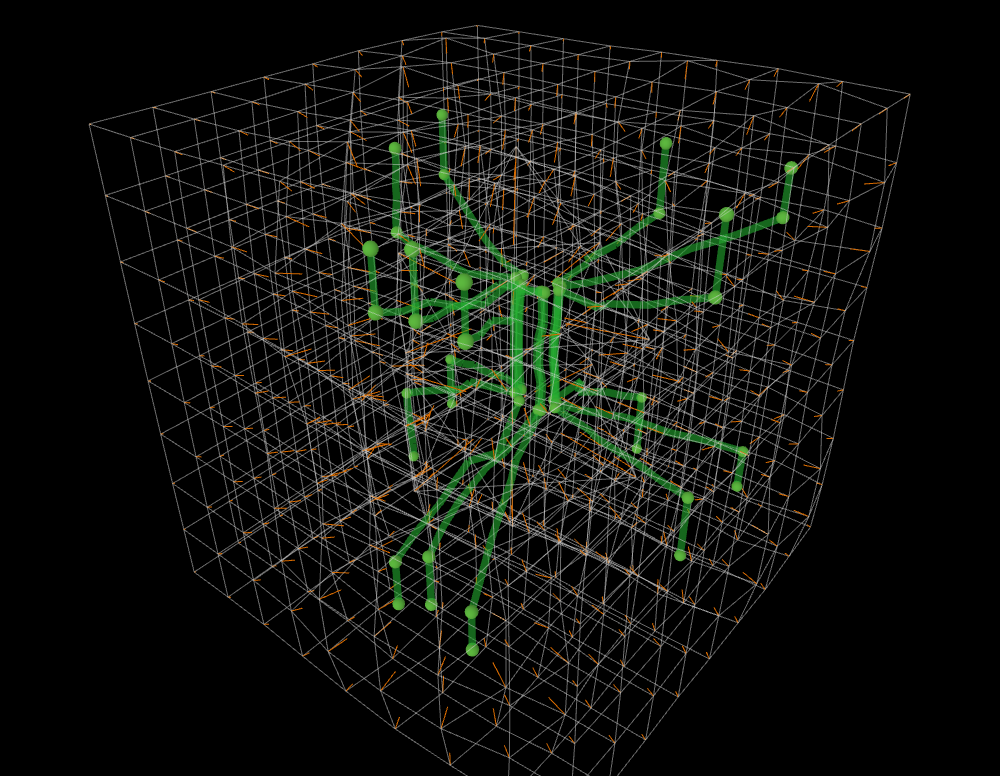

# Spacetime cartograms
Some experiments towards geographical spacetime (i.e. Hägerstrand-ian) diagrams with spacetime warped to accommodate events. This kind of thing:

which shows how a need to display more at the centre of the lattice can 'stretch' that space to accommodate the information.
